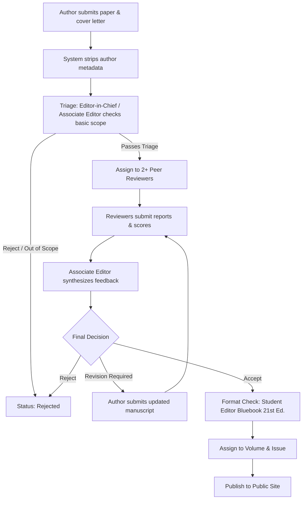

# 📘 NJLRII Subdomain Admin Portal Project Context
> **ISSN: 2582-8665** | Architecture, Workflows, CMS Controls, & Role-Based Access (RBAC)

Welcome to the central context manual for the **NJLRII (National Journal for Legal Research and Innovative Ideas)** Admin Portal project. This document defines the operational blueprint, workflows, and database layers required to build a highly responsive, secure, and beautiful administrative system deployed at `admin.njlrii.com`.

---

## 🏛️ 1. Project Vision & Architecture
The main public website (hosted on `njlrii.com` or `www.njlrii.com`) serves as a fast, highly optimized reader-facing library displaying published volumes, issues, and papers. The administrative panel is built as a **decoupled, subdomain application** (`admin.njlrii.com`) to separate content reading from heavy administrative write operations.

### Benefits of the Decoupled Subdomain Approach:
* **Enhanced Security:** Keeps admin-only login forms, editorial routes, and database configuration away from public assets.
* **Performance Isolation:** Restricts memory-intensive actions (large PDF uploads, rich text rendering, batch Excel exports, and editorial audits) to the administrative environment.
* **Granular Scalability:** Allows independent updates, deployments, and testing schedules for the admin panel without interrupting public access.

---

## 👥 2. User Roles & Access Control (RBAC)
To protect academic integrity and ensure legal citation compliance (Bluebook 21st Edition), the admin panel enforces a strict hierarchy of operations. Users log in through a centralized Supabase Auth interface and receive a designated role assigned in the metadata or a dedicated `user_roles` lookup table.

| User Role | Dashboard Access | Core Permissions | Key Responsibilities |
| :--- | :--- | :--- | :--- |
| **Super Admin /<br>Editor-in-Chief** | Full System Access | Complete CRUD on all databases, system setting overrides, user account approvals, RLS policy changes. | Approving final issues, registering editors, overriding manuscript assignments, managing storage. |
| **Associate Editor** | Editorial Panel | CRUD on manuscripts assigned to their area, assigning reviewers, uploading editorial decisions. | Coordinating review processes, writing synthesis reports, communicating with authors. |
| **Student Editor** | CMS & Verification Panel | Read-only access to manuscripts, edit permissions for `posts`, draft format and citation auditing. | Reviewing Bluebook 21st Ed. formatting, checking plagiarism reports, drafting newsletters/posts. |
| **Peer Reviewer** | Blind Review Console | Read assigned anonymous manuscripts, download review packets, submit review scorecards. | Writing objective review comments, scoring submissions (1-10), and recommending actions. |
| **Author** *(External)* | Author Portal | Upload new manuscripts, check submission statuses, view reviewer feedback summaries, upload revisions. | Registering manuscripts, submitting cover letters, submitting revised drafts. |

---

## 📝 3. Manuscript Submission & Double-Blind Review Pipeline
The core engine of NJLRII is its **Double-Blind Peer Review System**. In this workflow, the reviewer's identity is concealed from the author, and the author's identity is concealed from the reviewer to ensure unbiased legal critique.



### 📂 Phase 1: Author Submission & Upload Architecture
1. **Split Upload Inputs:** The submission form must prompt the author for two separate uploads:
   * **Blind Manuscript:** The PDF paper containing *only* the title, abstract, keywords, and body text. All author names, affiliations, designations, and references in footnotes must be stripped.
   * **Cover Letter / Title Page:** A separate document containing the full metadata (Author names, Email addresses, Affiliations, Acknowledgments).
2. **Storage Bucket Organization:** Document uploads are organized inside a private Supabase Storage bucket (`submissions/`) utilizing safe, randomized naming hashes to prevent directory enumeration:
   * File path pattern: `submissions/drafts/{manuscript_id}_blind_draft.pdf`
   * File path pattern: `submissions/metadata/{manuscript_id}_cover_letter.pdf`

### 🔎 Phase 2: Editorial Triage & Assignment
* **Initial Checks:** Associate Editors perform formatting, plagiarism, and scope checks.
* **Assigning Reviewers:** Editors query active `Reviewer` profiles and click "Assign". The system records reviewer assignments without exposing author profiles.

### 🗳️ Phase 3: Reviewer Assessment & Scorecards
* **Anonymous Access:** The reviewer logs into a minimalist portal where they see their queue. They can only view the abstract, keywords, and download the blind manuscript.
* **Scorecard Evaluation:** Reviewers submit a scorecard containing:
  * *Legal Innovation Rating* (1 to 10)
  * *Methodological Accuracy* (1 to 10)
  * *Bluebook/Citation Quality* (1 to 10)
  * *Comments for the Author* (blind text)
  * *Comments for the Editorial Board* (private text)

### 📈 Phase 4: Revision & Issue Assignment
* **Revision Rounds:** If revisions are requested, the manuscript enters the `revision` stage. The author uploads a clean draft replacing the original blind manuscript.
* **Acceptance:** Once accepted, the paper's details are converted into a row within the `papers` table, and assigned an `issue_id` to prepare for release.

---

## 🗃️ 4. Extended Database Schema Context
To accommodate both the active CMS and the detailed manuscript review system, the database architecture incorporates core public tables alongside extended workflow structures:

### A. Extended Database Relationships Entity Diagram

```mermaid
erDiagram
    user_profiles {
        uuid id PK "Supabase Auth reference"
        text email
        text full_name
        text role "super_admin | editor | student_editor | reviewer | author"
        timestamp created_at
    }
    manuscripts {
        bigint id PK
        uuid primary_author_id FK "References user_profiles.id"
        text title
        text abstract
        text[] keywords
        text blind_draft_url "Anonymous PDF Storage URL"
        text cover_letter_url "Private Author Info PDF"
        text status "submitted | triage | under_review | revision | accepted | rejected"
        bigint assigned_editor_id FK "References user_profiles.id"
        bigint target_issue_id FK "References issues.id (Optional)"
        timestamp created_at
    }
    reviewer_assignments {
        bigint id PK
        bigint manuscript_id FK "References manuscripts.id"
        uuid reviewer_id FK "References user_profiles.id"
        text status "pending | accepted | declined | completed"
        timestamp assigned_at
        timestamp completed_at
    }
    peer_reviews {
        bigint id PK
        bigint assignment_id FK "References reviewer_assignments.id"
        int score_originality "1-10"
        int score_structure "1-10"
        text comments_for_author
        text comments_for_editor
        timestamp submitted_at
    }
    volumes {
        bigint id PK
        int number
        int year
    }
    issues {
        bigint id PK
        bigint volume_id FK
        int number
        int year
        text title
    }
    papers {
        bigint id PK
        bigint issue_id FK
        text title
        text abstract
        text[] keywords
        text pdf_url
        text doi
        text slug
        jsonb author_metadata
        timestamp published_at
    }

    user_profiles ||--o{ manuscripts : "authors"
    user_profiles ||--o{ manuscripts : "edits"
    manuscripts ||--o{ reviewer_assignments : "assigns"
    user_profiles ||--o{ reviewer_assignments : "conducts"
    reviewer_assignments ||--o| peer_reviews : "yields"
    volumes ||--o{ issues : "groups"
    issues ||--o{ papers : "publishes"
    issues ||--o{ manuscripts : "targets"
```


---

## 💻 5. CMS Core & Archive Control Features
Once a paper transitions from review to publication, the admin CMS manages its indexing to ensure high visibility on Google Scholar, HeinOnline, and research directories.

### A. Volume & Issue Releases
* **Volume Structure:** The academic structure uses Roman designations or digits (e.g. Volume 5). 
* **Issue Designations:** Published quarterly. To coordinate release on the public website, editors create issues linked to a parent volume. The public website immediately revalidates dynamic paths:
  `/archive/vol-{volume.number}/issue-{issue.number}`
  
### B. Research Paper Indexing & Scholarly Metadata
To ensure optimal Google Scholar indexing, the admin panel must gather and export high-fidelity metadata. When writing papers into the database, populate these tags:
1. **Google Scholar Metadata Standard:** Include inputs for authors to specify complete citations in the `author_metadata` JSONB array:
   ```json
   [
     {
       "name": "Prof. Dr. Ishaan Sen",
       "designation": "Professor & Head of Department",
       "affiliation": "National Academy of Legal Studies and Research (NALSAR), Hyderabad"
     }
   ]
   ```
2. **Slug Auto-Generator:** Automatically generate clean, search-friendly slugs on title input in the admin portal to keep routes optimized.
   * *Example:* "Digital Rights in the Age of Artificial Intelligence" ➡️ `digital-rights-in-the-age-of-artificial-intelligence`
3. **Citations Standardizer:** Prompt the editor to confirm citation formatting matching standard legal style conventions:
   * *Citation String Format:* `(2026) 5 NJLRII (Issue 1) {page_number}`
4. **DOI & External Links:** Input fields for formal Digital Object Identifier (DOI) registers, HeinOnline record links, and citation references.

### C. News, Announcements & Call for Papers Publisher
The `posts` table feeds the blog and news board on the public site.
* **Post Types:** Enforce selection of valid types:
  * `News` (Journal developments, institutional collaborations)
  * `Announcement` (Board notifications, editorial updates)
  * `Call for Papers` (Deadlines, submission themes, guideline requirements)
* **SEO Metadata Formats:** The admin post creator has dedicated inputs mapping directly into the `posts.seo_metadata` JSONB field, capturing `metaTitle` and `metaDescription` elements to boost Google Search Engine indexing.

---

## 🛠️ 6. Subdomain Interface Integration & Development Guidelines

When initializing your administrative project, follow these development paradigms to achieve maximum compatibility and clean, premium visual styling:

### 1. Unified Typography and Theming
Ensure your application references the custom styles inside the `admin-theme.css` stylesheet. Link Google Fonts (`Outfit`, `Inter`, `JetBrains Mono`) directly inside your layout files so dashboard grids and tables align with scholarly branding.

### 2. Utilizing React Templates
We have provided comprehensive, pre-configured React templates in `templates/ReactComponents.tsx` containing:
* **`DashboardShell`**: Collapsible left sidebar, navigation nodes, active session indicators, and header rows.
* **`PapersDataTable`**: Clean grid tables, filters, pagination handlers, search overrides, and status tags.
* **`SubmissionForm`**: Forms with dynamically nested JSONB inputs, author arrays, and tag managers.
* **`LoginScreen`**: Elegant branded authentication panel with focus effects.

### 3. Supabase Client Configuration
Initialize your Supabase integration in a central helper file (e.g. `@/lib/supabase.ts`):
```typescript
import { createClient } from '@supabase/supabase-js';

const supabaseUrl = process.env.NEXT_PUBLIC_SUPABASE_URL!;
const supabaseAnonKey = process.env.NEXT_PUBLIC_SUPABASE_ANON_KEY!;

export const supabase = createClient(supabaseUrl, supabaseAnonKey);
```

### 4. Row-Level Security (RLS) & Policies
To guard critical tables (`volumes`, `issues`, `papers`, `posts`, `manuscripts`), configure these security guards in your Supabase Console:
* **Public Access:** Write `SELECT` policies allowing public anonymous access to `volumes`, `issues`, `papers`, and `posts` so the client website loads them seamlessly.
* **Admin-Only Writes:** Write `INSERT`, `UPDATE`, and `DELETE` policies that check if the authenticated user's metadata contains an approved role:
  ```sql
  -- Example policy check
  (auth.jwt() -> 'user_metadata' ->> 'role') IN ('super_admin', 'editor')
  ```
* **Author-Specific Isolations:** Allow authors to read and update rows in `manuscripts` only where `primary_author_id = auth.uid()`.

---

> [!NOTE]
> For direct reference on typography tokens, responsive tables, badge states, and CSS variables, review the [THEME_GUIDE.md](file:///Users/ayush/Downloads/njlrii%20website/admin-theme-pack/THEME_GUIDE.md) document in your theme pack.

> [!IMPORTANT]
> Keep the main frontend repository (`/frontend`) clean of administrative code. The admin panel must be built, tested, and compiled entirely in its own dedicated subdomain sandbox repository, utilizing this context pack for design and functional blueprints.

---
*Created and maintained by the NJLRII Technical Editorial Board.*
