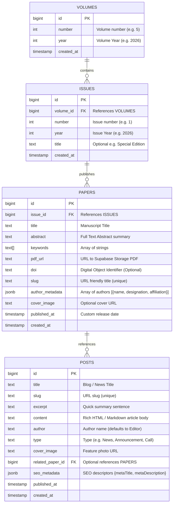

# NJLRII Subdomain Admin Panel Theme & Context Pack
> **ISSN: 2582-8665** | Official Branding & Integration Guide

Welcome to the **NJLRII Developer & Theme Context Pack**! This package contains everything you need to build a fully aligned, premium, and unified administrative dashboard for managing the National Journal for Legal Research and Innovative Ideas database and website content.

By separating the admin panel into its own project (e.g. `admin.njlrii.com`), you protect main site performance and restrict management routes to authorized editors. This guide, along with the included stylesheet and React templates, ensures that the new admin interface retains the exact same scholarly, high-fidelity academic identity as the public portal.

---

## 📂 Pack Structure
The theme pack contains the following files in your workspace under the `/admin-theme-pack/` folder:
1. `admin-theme-pack/THEME_GUIDE.md`: This comprehensive design manual and schema reference.
2. `admin-theme-pack/admin-theme.css`: A drop-in CSS file providing the core colors, variables, resets, responsive grid containers, form styles, dashboards, tables, and badge modifiers.
3. `admin-theme-pack/templates/ReactComponents.tsx`: Highly structured React/Next.js UI templates including a premium dashboard shell, database CRUD forms, tables, and auth screens.

---

## 🎨 1. Design Tokens & Variables
To ensure visual consistency, the admin panel must use the exact same brand identifiers. These are set up inside `admin-theme.css` as native CSS custom properties under `:root`:

### A. Color Palette
| Token | Variable | HEX Code | Purpose |
| :--- | :--- | :--- | :--- |
| **Primary Red** | `--primary` | `#fc0434` | Brand accent, active states, buttons, primary CTAs |
| **Primary Dark** | `--primary-dark` | `#cc0329` | Button hover states, prominent headers |
| **Primary Light**| `--primary-light`| `#ff3b5e` | Soft alerts, focus accents, border highlights |
| **Deep Charcoal** | `--foreground` | `#0f172a` | Primary typography, sidebar background, strong text |
| **Off-White Page**| `--background` | `#ffffff` | Page content areas, card containers, dialog backgrounds |
| **Silver Gray** | `--surface` | `#f8fafc` | Subtle dashboard backgrounds, table alternates |
| **Cool Gray** | `--muted` | `#64748b` | Subheadings, caption labels, icons |
| **Sleek Border** | `--border` | `#e2e8f0` | Structured grids, dividers, input borders |
| **Success Emerald**| `--success` | `#10b981` | Approved papers, active issues, successful actions |
| **Error Crimson** | `--error` | `#ef4444` | Deleted records, missing fields, validation failures |

### B. Typography
We leverage Google Fonts to load the exact typefaces representing scholarly trust and premium modernity:
- **Headings & Badges**: `'Outfit', sans-serif` (Heavy Weights: `600`, `700`, `800`) – conveys modern, clean academic strength.
- **Body Copy & UI Inputs**: `'Inter', sans-serif` (Weights: `300`, `400`, `500`, `600`) – provides maximum readability for tabular data.
- **System Codes & ISSN Info**: `'JetBrains Mono', monospace` – used for ISSN labels, metadata, indexing properties, and DOI codes.

```html
<!-- Load these fonts in your admin panel html head -->
<link rel="preconnect" href="https://fonts.googleapis.com">
<link rel="preconnect" href="https://fonts.gstatic.com" crossorigin>
<link href="https://fonts.googleapis.com/css2?family=Inter:wght@300;400;500;600;700&family=Outfit:wght@600;700;800&family=JetBrains+Mono:wght@400;500;700&display=swap" rel="stylesheet">
```

### C. Shadow & Glassmorphism System
- **Subtle Elevation** (`--shadow-sm`): `0 1px 2px 0 rgb(0 0 0 / 0.05)` – for standard input elements.
- **Premium Cards** (`--shadow-md`): `0 4px 6px -1px rgb(0 0 0 / 0.1), 0 2px 4px -2px rgb(0 0 0 / 0.1)` – for dashboard widgets.
- **Floating Modals** (`--shadow-lg`): `0 10px 15px -3px rgb(0 0 0 / 0.1), 0 4px 6px -4px rgb(0 0 0 / 0.1)` – for dialogs and sidebar menus.
- **Glass Card Overlay** (`--glass`): `rgba(255, 255, 255, 0.8)` with backdrop blur of `10px` and border `rgba(255, 255, 255, 0.2)` – for header overlays.

---

## 🗄️ 2. Supabase Database Schema Context
Your subdomain admin panel will execute direct **CRUD operations** on the same Supabase database. To write accurate models, here is the exact database schema mapped directly from the main website queries:



### Table Definitions & Field Requirements

#### A. Table: `volumes`
Stores the high-level journals structures (e.g., Volume 5).
- `id` (bigint, primary key): Autoincrementing unique ID.
- `number` (integer, required): The numeric designation (e.g., `1` for Vol. 1).
- `year` (integer, required): Calendar year (e.g., `2026`).
- `created_at` (timestamp, defaults to now).

#### B. Table: `issues`
Represents quarterly releases in each volume (e.g., Vol. 5 Issue 2).
- `id` (bigint, primary key): Unique ID.
- `volume_id` (bigint, foreign key, required): References `volumes.id`.
- `number` (integer, required): The issue sequence (e.g., `1` for Issue 1).
- `year` (integer, required): Calendar year (e.g., `2026`).
- `title` (text, optional): Label for special topics.
- `created_at` (timestamp).

#### C. Table: `papers`
Holds the core academic research papers published in the journal.
- `id` (bigint, primary key): Unique ID.
- `issue_id` (bigint, foreign key, required): References `issues.id`.
- `title` (text, required): Full title of the scholarly article.
- `abstract` (text, required): Long academic summary.
- `keywords` (text array - `text[]`, required): Descriptive keywords.
- `pdf_url` (text, required): Absolute URL pointing to the hosted PDF manuscript.
- `doi` (text, optional): Digital Object Identifier.
- `slug` (text, required, unique): URL-friendly string generated from the title.
- `author_metadata` (jsonb, required): JSON Array of author profiles. **Crucial Format Structure**:
  ```json
  [
    {
      "name": "Dr. Aarav Patel",
      "designation": "Associate Professor of Law",
      "affiliation": "National Law University, Delhi"
    }
  ]
  ```
- `cover_image` (text, optional): Image overlay for the publication.
- `published_at` (timestamp, optional): Date showing online publication.
- `created_at` (timestamp).

#### D. Table: `posts`
Represents news, journal updates, calls for papers, and blogs.
- `id` (bigint, primary key): Unique ID.
- `title` (text, required): Title of the post.
- `slug` (text, required, unique): URL-friendly handle.
- `excerpt` (text, required): A brief description displayed on the blog search feed.
- `content` (text, required): HTML formatted body text of the article.
- `author` (text, defaults to "NJLRII Editor").
- `type` (text, required): Type category such as `News`, `Announcement`, or `Call for Papers`.
- `cover_image` (text, optional): Thumbnail image.
- `related_paper_id` (bigint, foreign key, optional): References `papers.id` to recommend a research article.
- `seo_metadata` (jsonb, required): Object containing SEO attributes:
  ```json
  {
    "metaTitle": "NJLRII Vol 5 Call for Papers",
    "metaDescription": "Submit your legal manuscripts to the premier quarterly law journal..."
  }
  ```
- `published_at` (timestamp).
- `created_at` (timestamp).

---

## 🛠️ 3. Layout Architecture & Subdomain Best Practices
When building your subdomain admin interface, incorporate these **Premium UX Patterns** to maintain elite visual design standards:

1. **Dashboard Shell**: Use a left-side navigation drawer (fixed, `--foreground` slate styling) combined with a flexible right-side scrollable content container to display database listings.
2. **Metrics & Quick Stats**: Top rows should highlight major metrics (e.g. *Total Published Papers*, *Active Call for Papers*, *Pending Review Tasks*, *Volume Count*) using responsive cards that lift on hover (`transform: translateY(-2px)`).
3. **Responsive Table Grids**: Use the customized `.admin-data-table` class from the stylesheet. This table includes alternating row zebra shading, clean status pill badges, and direct action icons (Edit, View, Delete).
4. **Rich Editors for Blog Content**: Use clean typography in textareas. For `posts.content`, consider integrating a lightweight WYSIWYG editor (like *TipTap*, *Quill*, or *Editor.js*) that outputs semantic HTML, as the main frontend parses `post.content` using `dangerouslySetInnerHTML`.
5. **Interactive Feedback States**: Maintain smooth animations on form submits and button hovers. Add subtle micro-animations (like a pulse dot for active states) and use hover styles that display the iconic brand red.

---

## 🚀 4. How to Initialize Your Admin Panel Project
When you launch the admin panel as a separate workspace, follow these setup steps:

1. **Create the Project Directory**:
   Run the following commands in your shell to kickstart a brand-new Next.js/React framework:
   ```bash
   npx -y create-next-app@latest njlrii-admin-panel --ts --src --app --no-tailwind --no-eslint --import-alias "@/*"
   ```
2. **Import the Theme Resources**:
   - Copy the `admin-theme.css` file into your new project's `/src/app/globals.css`.
   - Copy the templates from `ReactComponents.tsx` to quickly create layouts and database panels.
3. **Configure Environment Variables**:
   In your new project's root, create a `.env.local` file with the shared Supabase keys:
   ```env
   NEXT_PUBLIC_SUPABASE_URL=your_supabase_url
   NEXT_PUBLIC_SUPABASE_ANON_KEY=your_supabase_anon_key
   # Add secure service role keys in backend routes if you need to bypass Row-Level Security (RLS) for edits
   SUPABASE_SERVICE_ROLE_KEY=your_supabase_service_role_key
   ```
4. **Authentication Guidelines**:
   Since the database handles critical journal entries, enforce role-based access. Use Supabase Auth with email verification. Protect all routes (e.g., `/dashboard/*`) with Next.js Middleware or client-side context filters.

---

*This Context Pack was automatically generated by Antigravity in align with the core NJLRII structural framework.*
